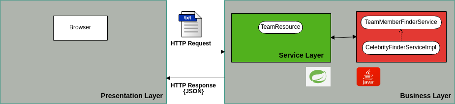
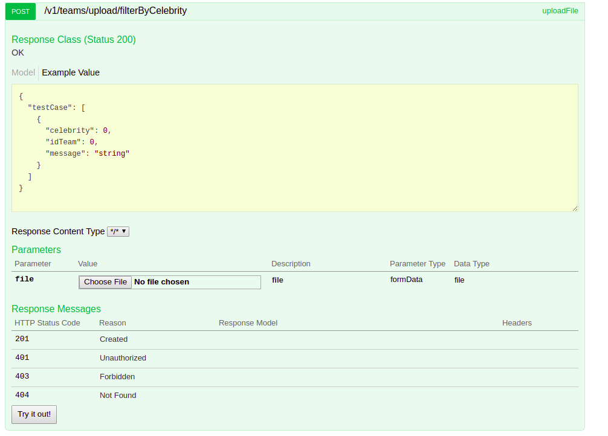

# Find the celebrity

In a team of n people, a celebrity is known by everyone but he/she doesn't know anybody.

## Application Layer



## Responsabilities

### Business/Service Layer

#### TeamResource

RestFul web service who exposes a resource to upload a file. It will process a file with the test cases of the problem and it will response a JSON object with the results of the test cases received. 

This resource will invoke to TeamMemberFinderService service in order to find the celebrity of a team.

#### CelebrityFinderServiceImpl

It's implementation class for an interface called TeamMemberFinderService, has the logic to find a celebrity of a team given.


###### **Request Info**

+ **Http Method:** POST
+ **URI:**  ````/v1/teams/upload/filterByCelebrity````
+ **Content-Type:** text/plain
+ **Headers:**  multipart/form-data
+ **Request PayLoad:**  Content-Type: text/plain

## File of Test Cases

### Input Format 

The first line contains an integer T, the number of test-cases. T testcases follow. 

For each test case, the first line will contain two integers N and M separated by a single space. N defines the team ID and M defines the number of the members of the team. Each test cases corresponds to a team concept.

```
1 5  [ [N,M] = Team Id, members of the Team ]
```

The next M lines will contain separated by a single space:

```
[J, K...] = Member Id, Members known by A
```

### Output Format 

The service will response a JSON document with the result of each test case. 

### Sample Input

```
2
1 5
1 
2 1 3
3 1 4
4 1 2
5 1 3
2 3
1 1
2 1
3 1
```

### Sample Output

```json

{
  "testCase": [
    {
      "idTeam": 1,
      "celebrity": 1,
      "message": "Celebrity Found with ID: 1"
    },
    {
      "idTeam": 2,
      "celebrity": -1,
      "message": "Celebrity not found"
    }
  ]
}
```

### Explanation

There are two test cases. The first with team number one, have five members, the second one with team ID two, have 3 members.

In the first team, the member 1 doesn't have a known. (celebrity). The others members knows to the member 1 and other members. The celebrity found is the member 1 of the team.

In the second team, all members known a member with ID 1. There isn't a celebrity.


## Uploading a Test File

The port defined for the server is 8585.


The documentation of the rest service is exposed using Swagger UI.

```
http://localhost:8585/swagger-ui.html
```




